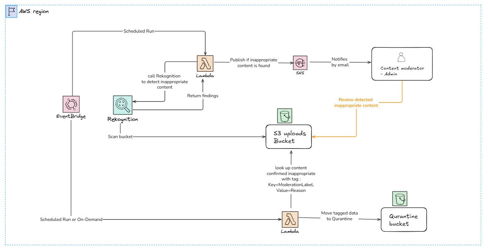

# Image Moderator for S3 Bucket — managed with Terraform on AWS

  


## Overview

`s3_image_moderator` is an AWS-based automation that scans images stored in an existing **Amazon S3** bucket for 
inappropriate or unsafe content using **Amazon Rekognition**.
It configured to run automatically (e.g., every 24 hours) and notifies administrators when potential violations are found.

- **EventBridge** triggers a **Lambda function** on schedule.
- Lambda lists images in the S3 bucket.
- For each image, it calls Rekognition’s Moderation API.
- Detected issues (e.g., nudity, violence) are logged and sent to **SNS** for admin notification.
- Admins review flagged images, tag them as “Safe” or “Flagged,” and quarantine violations.

## Usage

Use in a terraform project by importing the module:

```text
module "image_uploader" {
  source = "git::https://github.com/lrasata/infra-s3-image-moderator.git//modules/s3_image_moderator?ref=v1.0.0"

  region                    = var.region
  environment               = var.environment
  s3_src_bucket_name        = var.s3_bucket_name
  s3_src_bucket_arn         = var.s3_bucket_arn
  s3_quarantine_bucket_name = var.s3_quarantine_bucket_name
  admin_email               = var.admin_email
}
```
>
> **Prerequisites** to successfully deploy this infrastructure, are described in the Prerequisites section of [DEVELOPMENT.md](DEVELOPMENT.md)
>

